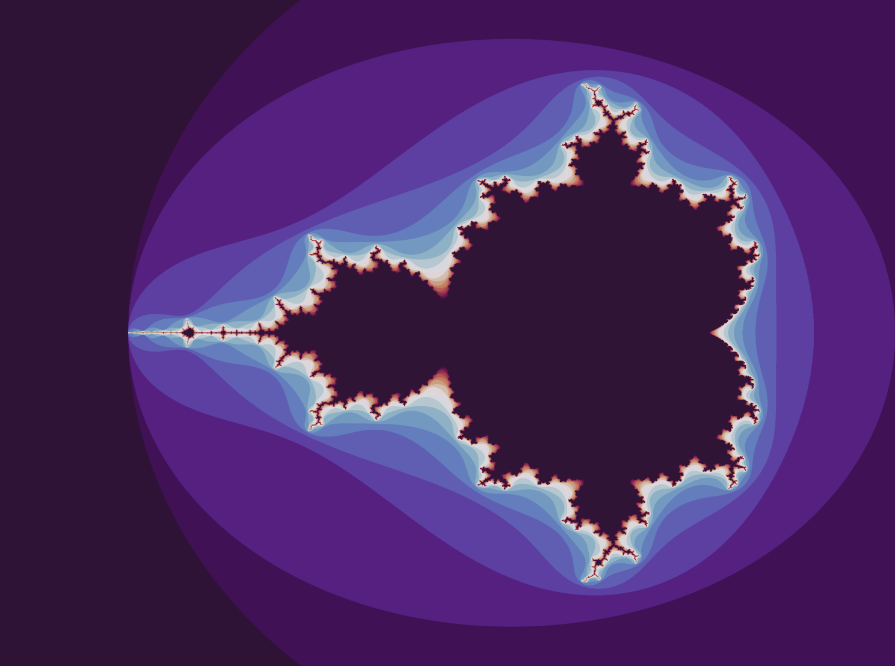

# MandelC

Generating the Mandelbrot set in ***C++***.  
\* *The calculations are performed in C++ and the visualization and CLI are implemented in Python.* 

## Running

### For help running: 

```sh
python3 run.py --help
```


The output, if run in generation mode, should be something of the kind\:  



