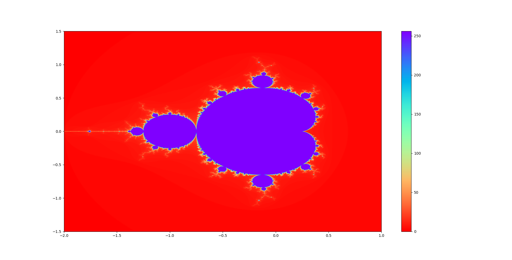

# MandelC

Generating the Mandelbrot set in ***C++***.  


## Running

### To run the running time tests

```sh
bash src/script_runner.sh src/static_runner.sh <insert output dir>
```

### To generate the picture 

The output of the main C++ Mandelbrot Set generator program is a matrix 
of integers. To generate an image from it, you can run the **python** script 
```vis.py``` as follows\:  

```sh
python3 src/vis.py
```  

The output should be somthing of the kind\:  


