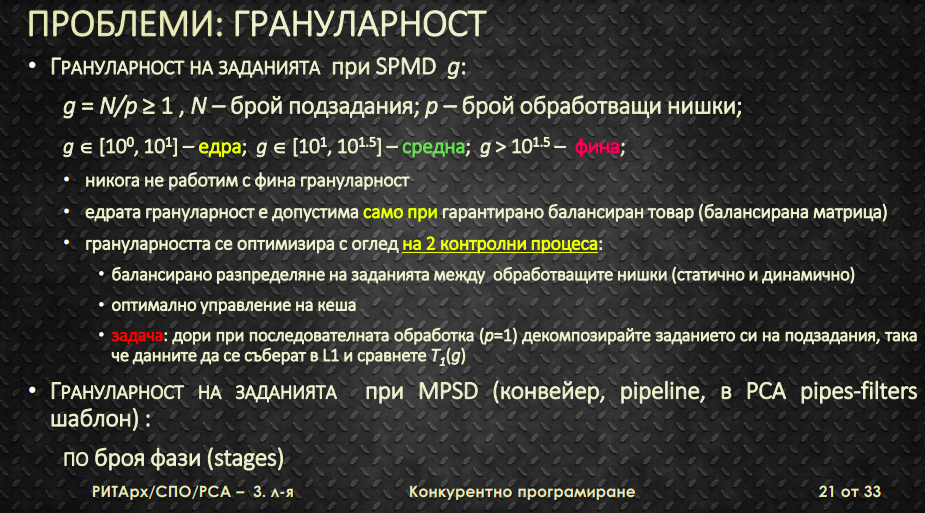
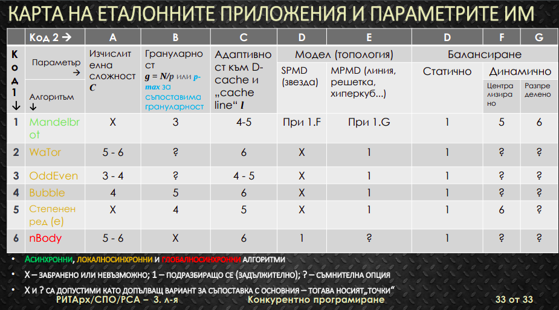
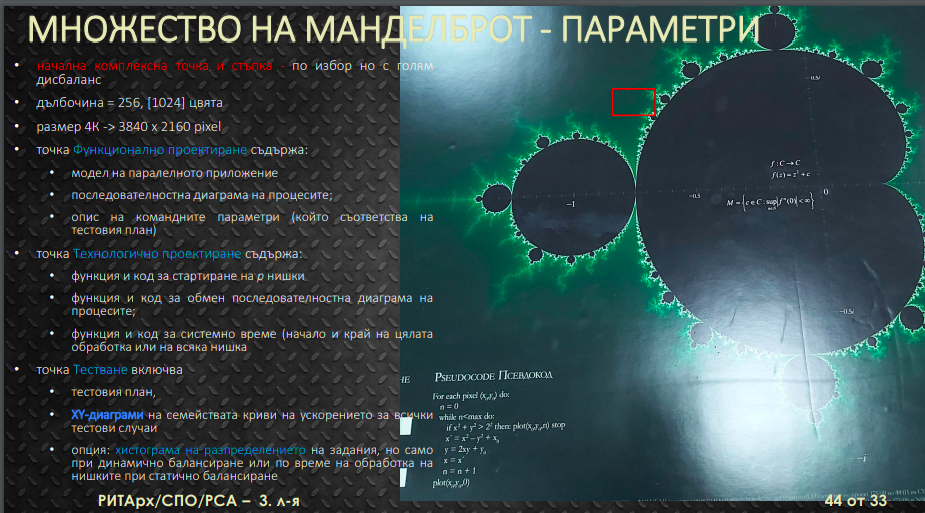

# URLS

* [Real Python](https://realpython.com/mandelbrot-set-python/)

Testing for convergence for complex numbers $c$ in the unit circle of the following sequence\:

$z_{0} = 0$  
$z_{n + 1} = {z_{n}}^2 + c$  

* Relation to the Julia Sets

You can obtain the Julia Sets and the Mandelbrot set through the same recursive formula, only with different sets of starting conditions.

While there's only one Mandelbrot set, there are infinitely manny Julia sets.

If a number belongs to a Julia set, you must use that number as the starting point for the sequence and picj another value for the $c$ parameter.

# Modules to be used

* the multiprocessing module
* numpy
* matplotlib
* pillow за по-"цветна" и интересна визуализация

Numpy and Matplotlib to conveniently convert between the world and pixel coordinates.

world coordinates -- the continuous spectrum of numbers on the complex plane, extending to infinity. Pixel coordinates are discrete and contrained bu the finite size of the screen. 

np.linspace() -- creates evenly spaced number in a given range

## Notes

## On Parallel programming lecture

Процесите, изпълняващи програмата в средите за паралелна обработка могат да бъдат алтернативно\:

* Single program multiple data - една програма върху различни данни

* MPMD --  

параметри\:

да разгледаме грануларност = g * Pmax броя подзадания  
да работим с такава грануларност, t.e. най-едра

* изчислителна сложност -- размер на матрицата
* брой итерации(брой итерации до определяне на принадлежност на комплексно число в множесетвото на Манделброт)
* брой процесори
* грануларност
* вид балансиране
    * стохастично статично 
    * **циклично статично**
    * **централизирано динамично**
    * динамично статично
    * централизирано разпределено

* сравнителни таблици

Декомпозиция по редове и по колони 

